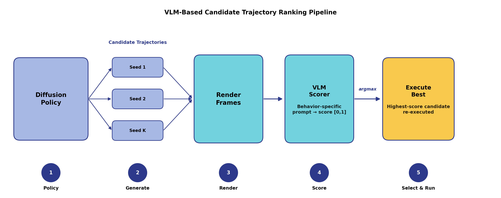
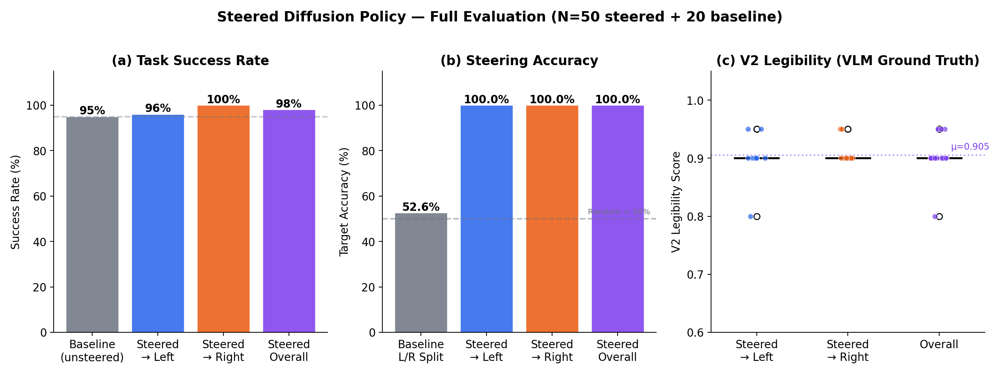
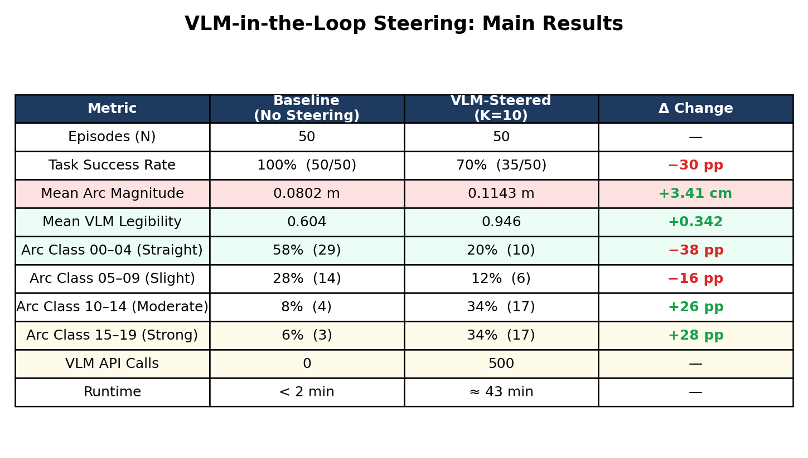
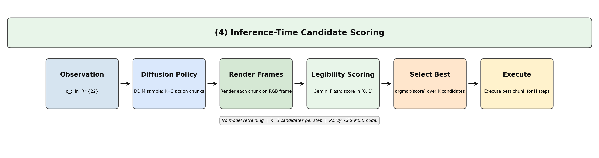

# Steering Diffusion Policies for Legible Robot Manipulation (CFG + VLM Reranking)

[](https://www.python.org/downloads/)
[](https://pybullet.org/)
[](LICENSE)

A behavior-conditioned diffusion policy for robot pick-and-place that can be steered at inference time, without retraining, to produce trajectories that are more legible, predictable, safe, or grounded. Steering works two ways: Classifier-Free Guidance (CFG) and VLM best-of-N reranking, where a vision-language model (Gemini, GPT, or Claude) scores candidate trajectories and the best one is executed. The setup uses a Franka Panda arm in PyBullet with a full data, training, steering, and evaluation pipeline.

This is the diffusion-policy part of my MS thesis, *Vision-Language Models as Proxies for Human Judgment of Robot Motion Legibility* (ASU, 2026). The VLM goal-inference benchmark is in the companion repo [gemini-vlm-goal-inference](https://github.com/agottap1-lang/gemini-vlm-goal-inference).

<p align="center">
  
</p>

## Overview

Robots that work near people need to do more than finish the task; their motion should communicate intent. A diffusion policy already generates many valid ways to do the same task, so instead of retraining a separate policy for each desired behavior, this project selects and steers among those candidates at inference time, using a VLM as an observer-style critic.

## What's in the repo

- A behavior-conditioned diffusion policy (DDPM U-Net, 8.8M params) trained on 500 demonstrations across 4 behavior styles.
- Two inference-time steering options that need no retraining: CFG (guidance scale λ) and VLM best-of-N reranking.
- A VLM critic that renders candidate rollouts to frames, scores each one with a behavior-specific prompt, and executes the highest-scoring candidate.
- An evaluation setup with compositional train/test splits, paired baselines, statistical tests, and per-behavior metrics (legibility, path efficiency, clearance, grounding).
- Reproducible runs: a unified CLI, YAML configs, fixed seeds, and checkpoints that bundle normalization stats.

## Results

Inference-time steering improves the target behavior without hurting task success. Across 4 behaviors (10 episodes each):

| Behavior | CFG-only success | Key metric (CFG) | + VLM best-of-N |
|---|:--:|---|:--:|
| Legibility | 10/10 | L_early = 0.900 ± 0.017 | 100% vs 40% random (6x) |
| Safety | 10/10 | min clearance, 0 collisions | success 7/10, clearance +0.43 vs random |
| Grounding | 9/10 | waypoint hover 0.079 ± 0.033 | +0.39 vs random |
| Predictability | 9/10 | path efficiency 0.424 ± 0.025 | weak (straight paths look alike) |

Full 3-stage pipeline (20 paired episodes):

| Stage | Success | Legibility (L_early) |
|---|:--:|:--:|
| Baseline (no steering) | 80% | 0.898 |
| + CFG guidance | 100% | 0.937 |
| + VLM reranking | 100% | 0.972 |

The VLM critic helps most with legibility. It reliably picks the trajectory that curves toward the intended block early, giving a 6x improvement over random candidate selection and +7.4 points of L_early end to end (p < 0.0001). For behaviors where the candidates all look visually similar, such as predictability, reranking adds little; this is noted under Limitations.

<p align="center">
  
  
</p>

## How steering works

<p align="center">
  
</p>

**1. Classifier-Free Guidance (CFG).** The policy is trained with 15% condition dropout, so it learns both conditional and unconditional scores. At inference, the denoising direction is pushed toward the target behavior:

$$\tilde{\epsilon} = \epsilon_\theta(\mathbf{x}_t, t, \varnothing) + \lambda\,\big(\epsilon_\theta(\mathbf{x}_t, t, \mathbf{c}) - \epsilon_\theta(\mathbf{x}_t, t, \varnothing)\big)$$

Sampling uses DDIM (η = 0.3) for stability while keeping the policy's multimodality.

**2. VLM best-of-N reranking.** Generate N candidate trajectories with different seeds, render key frames, ask a VLM to score each against a behavior-specific rubric, and execute the top-scored candidate. The rubric was validated against a hand-crafted metric (r = 0.992).

The two mechanisms are complementary: CFG shapes the distribution of candidates, and reranking selects the best realization within it.

## Quickstart

```bash
python -m venv .venv && .\.venv\Scripts\Activate.ps1   # Windows
pip install -r requirements.txt

python cli.py list                                     # show CLI commands
python cli.py quick-eval --episodes 3                  # smoke test
python cli.py evaluate-paired --episodes 10            # CFG vs baseline
python cli.py generate-videos --n-videos 5             # rollout videos
```

<details>
<summary><b>Full pipeline (collect, train, evaluate)</b></summary>

```bash
# 1. Collect demonstrations (4 behavior styles)
python scripts/collect_demos_cfg.py --n 500
# 2. Train behavior-conditioned diffusion policy (CFG, 200 epochs)
python scripts/train_cfg.py --config configs/train_combined.yaml
# 3. Evaluate CFG steering across behaviors
python evaluation/eval_cfg.py --ckpt runs/cfg_20260406_005407/ckpt_ep200.pt
# 4. Evaluate CFG + VLM best-of-N reranking
python evaluation/eval_cfg_vlm.py --ckpt runs/cfg_20260406_005407/ckpt_ep200.pt --n-candidates 4
```
The VLM key is read from the environment / `.env` (`GEMINI_API_KEY`); it is never hardcoded.
</details>

## Method and data details

<details>
<summary><b>Model and training configuration</b></summary>

| Parameter | Value |
|---|---|
| Architecture | DDPM 1-D U-Net (8.8M params), 6 ResBlocks, 256 hidden, FiLM time embedding |
| Obs / action dim | 26 (22 obs + 4 behavior one-hot) / 5 (Δx, Δy, Δz, Δyaw, gripper) |
| Horizon | 32 (predict 32, execute 8), closed-loop replanning |
| Diffusion | 100 steps, linear β 1e-4 to 0.1; DDIM η = 0.3 at inference |
| Training | 200 to 500 epochs, batch 256, AdamW 1e-4, EMA 0.999, CFG dropout 0.15 |
</details>

<details>
<summary><b>Task, behaviors, and evaluation protocol</b></summary>

- Task (TwoBlockPick): a Franka Panda must pick one of two blocks while expressing a target behavior.
- Behaviors: legibility (curve toward the target early), predictability (direct path), safety (clearance from the non-target block), grounding (pass through a task waypoint).
- Legibility metric (L_early): a Bayesian observer posterior over goals from a partial trajectory; higher means intent is revealed earlier.
- Compositional splits: held-out scene configurations and held-out trajectory arcs, to test generalization rather than memorization.
</details>

<details>
<summary><b>Limitations</b></summary>

- VLM predictability scoring is weak, because near-straight paths look identical to the model.
- DDPM at eval amplifies actions, so inference uses DDIM (η = 0.3); execute_steps=8 avoids out-of-distribution observations.
- Re-execution variance: the VLM selects from simulated candidates and then re-executes, and PyBullet stochasticity can cause small drift.
- Simulation only; sim-to-real transfer of the legibility signal is future work.
</details>

## Repository map

```
configs/        training configs (YAML)        envs/         PyBullet TwoBlockPick env
scripts/        data collection + training     evaluation/   CFG / VLM / BC evaluators
experiments/    staged evaluation              analysis/     legibility / arc / VLM analysis
figures/        figures                        thesis_materials/  thesis figures and LaTeX
cli.py          unified entry point            FINAL_RESULTS.md / THESIS_COMPARISON.md
```

## Status

The core method and evaluation were defended as my MS thesis. This repository is the working codebase and also contains additional, in-development experiments beyond the thesis scope; those are exploratory and still being validated.

## Citation

```bibtex
@mastersthesis{gottapu2026vlmlegibility,
  title  = {Vision-Language Models as Proxies for Human Judgment of Robot Motion Legibility},
  author = {Gottapu, Anudeep Sai},
  school = {Arizona State University},
  year   = {2026}
}
```

## License

MIT, see [LICENSE](LICENSE). Companion repo: [gemini-vlm-goal-inference](https://github.com/agottap1-lang/gemini-vlm-goal-inference). Advised by Prof. Nakul Gopalan (LOGOS Robotics Lab, ASU).
